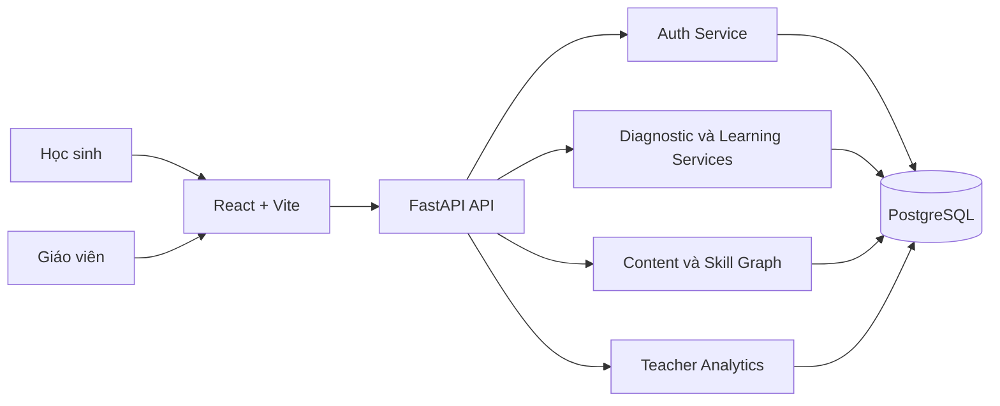
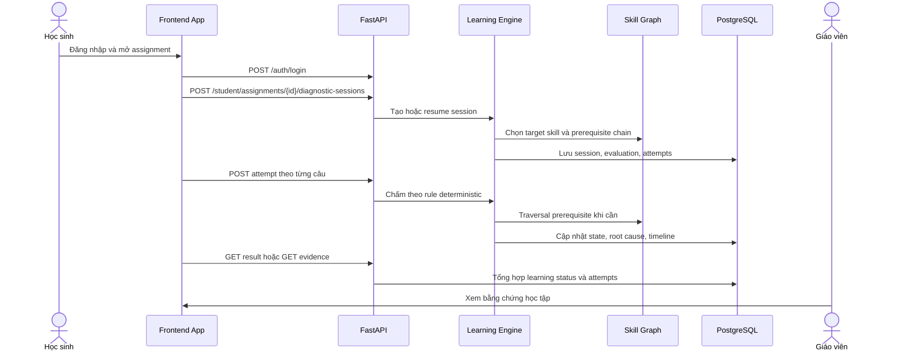
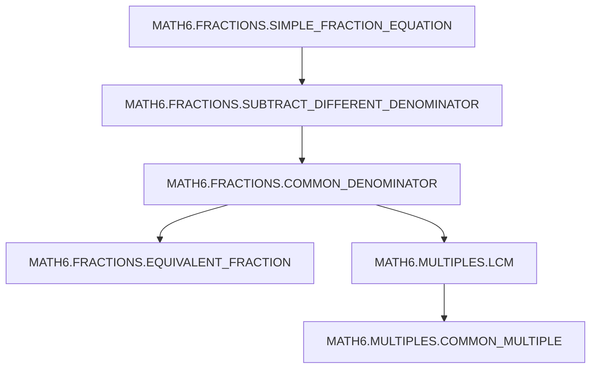
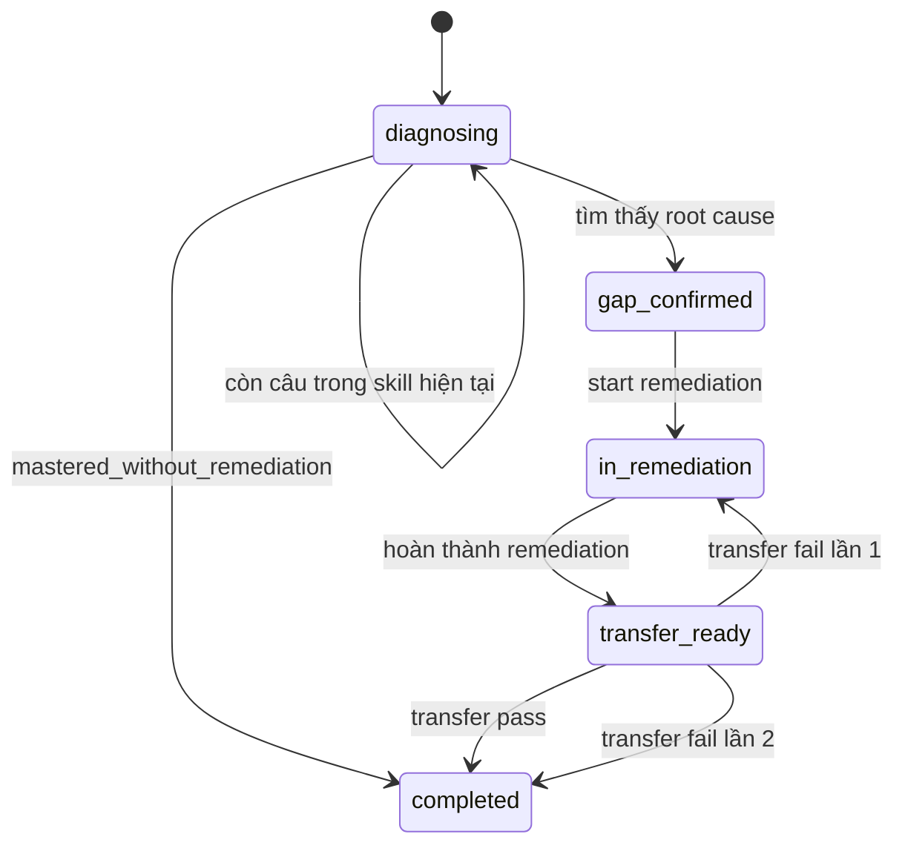
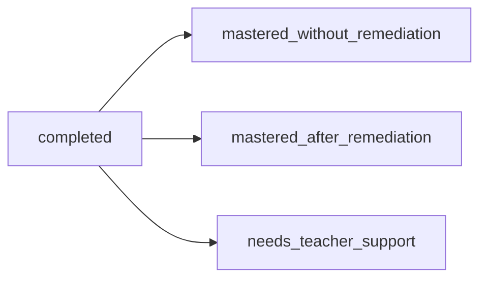
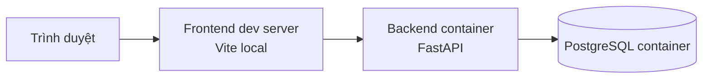
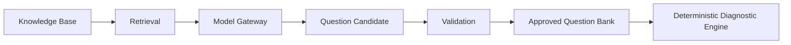

# Architecture

Tài liệu này mô tả kiến trúc của runtime hiện tại:

- Frontend: React + Vite
- Backend: FastAPI REST API
- Domain logic: service + state machine
- Persistence: PostgreSQL

AI runtime bên ngoài chưa được tích hợp vào backend hiện tại.

## Tổng quan

Frontend gọi FastAPI qua HTTP repository. Backend xác thực người dùng bằng opaque session token lưu trong cookie `HttpOnly`, sau đó điều phối luồng học sinh và giáo viên qua service layer.

Deterministic diagnostic engine hiện thực bằng:

- `DiagnosticService`
- `DiagnosticStateMachine`
- `LearningFlowService`
- `LearningStateMachine`
- `SkillGraphService`

Teacher evidence được tổng hợp từ assignment, learning session, transition timeline và attempt history trong PostgreSQL.

## Sơ đồ kiến trúc tổng thể



## Luồng User -> App -> Learning Engine hiện tại



## Luồng diagnostic

Luồng diagnostic hiện tại:

```text
Target skill
-> diagnostic questions
-> pass hoặc fail ở từng skill
-> prerequisite traversal
-> root-cause skill hoặc completed
-> remediation
-> transfer
-> result
```

Ví dụ với content package đang seed cho development:



Engine không dùng LLM để xác định root cause. Root cause được chọn từ prerequisite chain và kết quả pass/fail của từng skill evaluation.

## State machine

### Diagnostic session states



### Outcomes



## Teacher evidence

Teacher evidence hiện tại gồm:

- Giáo viên chỉ xem lớp thuộc quyền của mình.
- Assignment overview theo lớp và theo bài giao.
- Danh sách học sinh với trạng thái assignment và session.
- Root cause skill theo từng learning session nếu có.
- Timeline chuyển state từ `learning_session_transitions`.
- Attempt history theo các phase:
  - diagnostic
  - remediation
  - transfer

`is_correct` chỉ xuất hiện trong teacher evidence API, không được đưa vào student diagnostic payload đang mở.

## Deployment hiện tại



Runtime hiện tại dùng:

- `postgres` container từ `docker-compose.yml`
- `backend` container từ `docker-compose.yml`
- frontend chạy local bằng `npm run dev`

Không có frontend container hoặc Nginx trong active runtime hiện tại.

## AI roadmap

**Trạng thái:** Định hướng phát triển

AI hiện chưa nằm trong runtime FastAPI đang chạy. Hướng phát triển dự kiến là dùng AI cho sinh candidate content hoặc explanation, trong khi engine chẩn đoán vẫn là deterministic.



Nguyên tắc của roadmap này:

- AI dự kiến dùng để sinh candidate question và explanation.
- Rule engine vẫn quyết định pass/fail, traversal và root cause.
- API LLM ngoài là hướng triển khai ban đầu.
- Local model hosting là hướng nghiên cứu sau.
- Không thành phần AI nào ở trên được xem là đã triển khai trong backend hiện tại.
