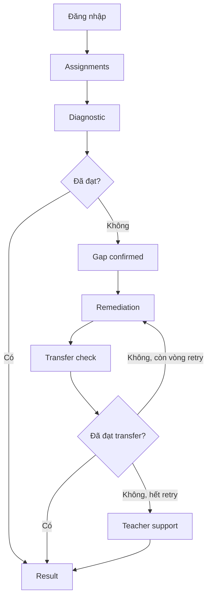

# Learning Flow

```mermaid
flowchart TD
    A[Đăng nhập]
    B[Assignments]
    C[Diagnostic]
    D{Đã đạt?}
    E[Gap confirmed]
    F[Remediation]
    G[Transfer check]
    H{Đã đạt transfer?}
    I[Result]
    J[Teacher support]

    A --> B --> C --> D
    D -- Có --> I
    D -- Không --> E --> F --> G --> H
    H -- Có --> I
    H -- Không, còn vòng retry --> F
    H -- Không, hết retry --> J --> I
```
