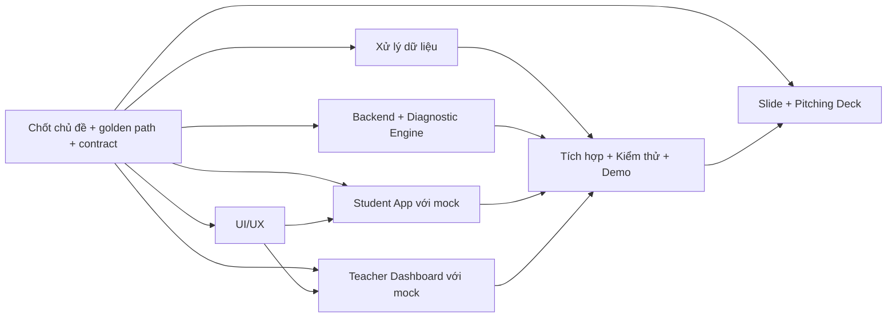

# Hackathon Work Breakdown — Mina AI

## 1. Mục đích

Đây là danh sách các task lớn dùng để chia việc trong hackathon. Tài liệu **không quản lý deadline, giờ công, sprint hoặc worklog**. Mỗi task có thể giao trọn cho một thành viên hoặc một nhóm nhỏ, miễn là bàn giao đúng output đã mô tả.

Phạm vi nội dung bị khóa: **Kết nối tri thức với cuộc sống — môn Toán lớp 6 và lớp 7**.

## 2. Lát cắt demo chung

Toàn đội cùng nhắm một golden path duy nhất:

```text
Giáo viên mở lớp demo
→ giao diagnostic Toán 6 hoặc 7 Kết nối tri thức
→ học sinh làm một nhóm câu hỏi
→ engine phát hiện một root-cause gap có evidence/confidence
→ dashboard xếp học sinh vào nhóm cần hỗ trợ
→ giáo viên giao remediation
→ học sinh làm transfer test
→ dashboard cập nhật gap thành provisionally_closed
```

Seed data có tối thiểu ba học sinh giả lập:

- Một em có root-cause gap rõ và hoàn thành remediation.
- Một em đã thành thạo.
- Một em trả về `insufficient_evidence` hoặc `outside_mvp_scope`.

## 3. Các task lớn

### Task 1 — Xử lý dữ liệu và Knowledge Graph

**Mục tiêu:** Chuẩn bị toàn bộ dữ liệu giáo dục cần cho kịch bản demo, chỉ sử dụng Toán lớp 6–7 bộ Kết nối tri thức.

**Mô tả:**

- Chọn một chương hoặc chuỗi kiến thức phù hợp để minh họa khả năng truy tìm nguyên nhân gốc.
- Trích xuất nội dung cần thiết từ nguồn được phép sử dụng và lưu provenance: bộ sách, lớp, chương, bài, trang.
- Chia nội dung thành các micro-skill.
- Xây các quan hệ prerequisite giữa micro-skill và bảo đảm không có vòng lặp.
- Xác định các misconception phổ biến và dấu hiệu nhận biết từ phương án sai.
- Soạn câu hỏi diagnostic, bài remediation và transfer test.
- Duyệt nội dung, đáp án và mapping trước khi đưa vào demo.
- Xuất dữ liệu theo định dạng thống nhất để backend và diagnostic engine có thể sử dụng trực tiếp.

**Output cụ thể:**

- Một knowledge graph nhỏ nhưng hoàn chỉnh cho kịch bản demo.
- Danh sách skills và prerequisite edges có ID ổn định.
- Danh sách misconceptions và error patterns.
- Bộ câu hỏi diagnostic có đáp án, distractor và misconception mapping.
- Ít nhất một remediation path và một transfer test.
- File seed data/JSON có version, provenance và trạng thái duyệt.
- Expected result cho ba học sinh giả lập trong lát cắt demo.

### Task 2 — Backend, Database và Diagnostic Engine

**Mục tiêu:** Cung cấp lớp nghiệp vụ và API để student app, teacher dashboard và dữ liệu giáo dục hoạt động thống nhất.

**Mô tả:**

- Thiết kế data model tối thiểu cho lớp học, học sinh, skills, questions, assignments, attempts, diagnosis, remediation và gap status.
- Tạo database migration và cơ chế nạp seed data từ Task 1.
- Xây API tạo/lấy lớp demo, giao assignment, ghi nhận attempt và trả dữ liệu dashboard.
- Xây diagnostic engine theo rule: correctness, distractor, misconception và prerequisite traversal.
- Tính confidence và tạo evidence có thể giải thích cho giáo viên.
- Xử lý các trạng thái `diagnosed`, `mastered`, `insufficient_evidence` và `outside_mvp_scope`.
- Chọn remediation phù hợp và cập nhật trạng thái sau transfer test.
- Bảo đảm gửi lại cùng một attempt không tạo dữ liệu trùng.
- Diagnostic realtime không phụ thuộc LLM.

**Output cụ thể:**

- Database schema và migration chạy được từ trạng thái sạch.
- Seed command/importer nạp được dataset demo.
- API contract kèm request/response mẫu cho frontend.
- API hoạt động cho assignment, attempt, diagnosis, dashboard, remediation và transfer result.
- Diagnostic engine trả đúng expected result của ba học sinh giả lập.
- Bộ test tối thiểu cho golden path và các trạng thái an toàn.
- Hướng dẫn chạy backend local và cấu hình môi trường mẫu không chứa secret.

### Task 3 — Student App

**Mục tiêu:** Xây trải nghiệm để học sinh tham gia lớp, làm diagnostic, nhận bài bù và hoàn thành transfer test.

**Mô tả:**

- Cho học sinh vào lớp demo bằng mã lớp hoặc chọn tài khoản giả lập.
- Hiển thị assignment và hướng dẫn ngắn.
- Xây question runner hỗ trợ công thức Toán, đáp án lựa chọn, tiến độ và hint.
- Gửi attempt theo API contract; có thể dùng mock data trước khi backend hoàn thành.
- Hiển thị trạng thái trung tính, không dùng nhãn “yếu”, “kém”, “mất gốc”.
- Điều hướng học sinh vào remediation path và sau đó tới transfer test.
- Hiển thị kết quả và quay lại target skill theo Repair and Return.
- Nếu còn khả năng, lưu attempt cục bộ để reload hoặc mất mạng ngắn không làm mất tiến độ.

**Output cụ thể:**

- Student web app chạy được trên màn hình desktop và mobile.
- Hoàn chỉnh các màn hình: vào lớp, danh sách nhiệm vụ, làm diagnostic, hint, remediation, transfer test và kết quả.
- Golden path chạy được bằng mock data độc lập với backend.
- Tích hợp được API thật mà không thay đổi luồng giao diện.
- Có trạng thái loading, empty, error và thông báo lưu/đồng bộ cơ bản.
- Không hiển thị dữ liệu của học sinh khác.

### Task 4 — Teacher Dashboard

**Mục tiêu:** Xây dashboard giúp giáo viên hiểu nhanh ai cần hỗ trợ, nguyên nhân là gì và nên hành động thế nào.

**Mô tả:**

- Hiển thị lớp demo và thao tác giao diagnostic.
- Hiển thị tổng quan kết quả lớp sau khi học sinh làm bài.
- Tạo priority list và nhóm học sinh theo root-cause gap, misconception hoặc trạng thái chưa đủ dữ liệu.
- Xây màn hình evidence detail gồm skill, confidence, bằng chứng và giới hạn của kết luận.
- Cho giáo viên giao remediation cho một học sinh hoặc nhóm.
- Hiển thị tiến độ remediation, transfer result và gap status.
- Có thể dùng mock data trước khi backend hoàn thành.
- Nếu còn khả năng, cho giáo viên chấp nhận, sửa hoặc bác diagnosis.

**Output cụ thể:**

- Teacher dashboard hoàn chỉnh cho golden path.
- Các màn hình: lớp học, giao diagnostic, tổng quan, priority list, auto-grouping, evidence detail và giao remediation.
- Hiển thị đúng ba học sinh giả lập với ba trạng thái khác nhau.
- Dashboard cập nhật được trạng thái `provisionally_closed` sau transfer test.
- Golden path chạy được với mock data và sau đó tích hợp API thật.
- Mọi số liệu có denominator, trạng thái dữ liệu và thời điểm cập nhật phù hợp.

### Task 5 — UI/UX và Nhận diện Sản phẩm

**Mục tiêu:** Tạo một ngôn ngữ giao diện thống nhất để student app, teacher dashboard và slide trình bày cùng một sản phẩm.

**Mô tả:**

- Vẽ wireflow cho golden path của học sinh và giáo viên.
- Chốt màu sắc, typography, spacing, icon và các component dùng chung.
- Thiết kế cách trình bày evidence/confidence dễ hiểu và không gây gắn nhãn học sinh.
- Chuẩn hóa copy tiếng Việt cho trạng thái thành công, chưa đủ dữ liệu, ngoài phạm vi, lỗi và mất mạng.
- Kiểm tra responsive, contrast và khả năng thao tác trên thiết bị mục tiêu.
- Chuẩn bị logo/wordmark hoặc visual identity tối thiểu dùng trong sản phẩm và slide.

**Output cụ thể:**

- Wireflow cho student app và teacher dashboard.
- Design tokens hoặc style guide ngắn.
- Bộ component/state mẫu cho frontend.
- Danh sách copy chuẩn cho các trạng thái quan trọng.
- Logo/wordmark và bộ asset dùng chung ở định dạng phù hợp.
- Checklist UI để kiểm tra hai frontend trước khi demo.

### Task 6 — Tích hợp, Kiểm thử và Chuẩn bị Demo

**Mục tiêu:** Nối các phần thành một luồng ổn định, có thể chạy lại nhiều lần và không phụ thuộc hoàn toàn vào Internet hoặc AI provider.

**Mô tả:**

- Chốt shared API contract và fixtures dùng chung giữa frontend, backend và diagnostic engine.
- Nối Student App, Backend, Diagnostic Engine và Teacher Dashboard theo golden path.
- Kiểm tra seed data và reset lại trạng thái demo.
- Kiểm tra các nhánh: root-cause rõ, mastered, chưa đủ dữ liệu và ngoài phạm vi.
- Kiểm tra reload, gửi attempt lặp, lỗi API và dữ liệu rỗng.
- Chuẩn bị tài khoản, mã lớp và dữ liệu demo cố định.
- Chuẩn bị phương án fallback khi mạng, backend hoặc provider bên ngoài gặp lỗi.
- Viết hướng dẫn chạy demo theo từng bước.

**Output cụ thể:**

- Một bản build tích hợp chạy được golden path end-to-end.
- Shared fixtures và contract được version hóa.
- Script hoặc hướng dẫn reset seed data.
- Checklist smoke test trước khi trình bày.
- Demo script kỹ thuật ghi rõ thao tác, kết quả mong đợi và điểm cần nhấn mạnh.
- Phương án fallback bằng local seed/mock data; có thể bổ sung video dự phòng.

### Task 7 — Slide và Pitching Deck

**Mục tiêu:** Kể câu chuyện sản phẩm ngắn, rõ và nhất quán với bản demo để ban giám khảo hiểu vấn đề, điểm khác biệt và giá trị của Mina AI.

**Mô tả:**

- Xây narrative: vấn đề lớp học trình độ không đồng đều → hạn chế của cách chấm điểm hiện tại → Mina AI truy nguyên khoảng trống → giáo viên hành động → học sinh bù hổng và quay lại bài chính.
- Trình bày phạm vi MVP chính xác: Kết nối tri thức, Toán lớp 6–7.
- Minh họa một tình huống học sinh cụ thể thay vì liệt kê quá nhiều tính năng.
- Giải thích điểm khác biệt: root-cause diagnostic, teacher intervention dashboard, Repair and Return và offline/low-bandwidth.
- Chuẩn bị sơ đồ giải pháp/kiến trúc ở mức đủ hiểu, tránh sa vào chi tiết stack.
- Đưa demo vào đúng vị trí trong pitch và thống nhất câu chuyển giữa người nói với người thao tác.
- Chuẩn bị câu trả lời cho các câu hỏi về accuracy, dữ liệu trẻ em, AI hallucination, offline, khả năng mở rộng và mô hình kinh doanh.

**Output cụ thể:**

- Một pitching deck hoàn chỉnh, dùng chung nhận diện với sản phẩm.
- Cấu trúc slide đề xuất:
  1. Tên dự án và one-liner.
  2. Vấn đề và người dùng.
  3. Ví dụ lỗi bề mặt và root cause.
  4. Giải pháp Mina AI.
  5. Luồng giáo viên–học sinh.
  6. Demo.
  7. Điểm khác biệt và vai trò AI.
  8. Phạm vi MVP và kiến trúc.
  9. Tác động/KPI kỳ vọng.
  10. Hướng mở rộng và lời kết.
- Speaker notes hoặc pitching script cho từng slide.
- Danh sách câu hỏi phản biện và câu trả lời ngắn.
- Bản PDF dự phòng và asset demo được đóng gói cùng deck.

## 4. Những phần có thể làm song song

Ngay sau khi chốt chủ đề demo và API contract tối thiểu:

- **Xử lý dữ liệu** xây dataset và expected results.
- **Backend/Diagnostic Engine** dựng schema, API và engine từ fixture mẫu.
- **Student App** xây luồng với mock API.
- **Teacher Dashboard** xây luồng với mock API.
- **UI/UX** hoàn thiện design system và copy, bàn giao dần cho hai frontend.
- **Slide/Pitching Deck** xây narrative từ problem statement, sau đó cập nhật ảnh/video từ sản phẩm.

Task **Tích hợp, Kiểm thử và Chuẩn bị Demo** theo dõi contract từ đầu nhưng chỉ nối end-to-end khi các output lõi sẵn sàng.



## 5. Output chung của toàn đội

Toàn bộ công việc được coi là hoàn thành khi có:

1. Một dataset demo đã duyệt thuộc Toán 6–7 Kết nối tri thức.
2. Một golden path chạy end-to-end từ giáo viên tới học sinh và quay lại dashboard.
3. Student app và teacher dashboard thống nhất UI, copy và API contract.
4. Diagnostic có evidence/confidence và xử lý an toàn khi chưa đủ dữ liệu hoặc ngoài phạm vi.
5. Seed data có thể reset và phương án demo fallback.
6. Pitching deck, pitching script và bộ câu trả lời phản biện nhất quán với sản phẩm thực tế.
