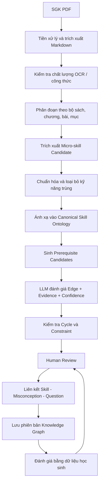

# Hướng dẫn Chuyển đổi Sách giáo khoa PDF thành Knowledge Graph (Bản đồ tri thức)

Tài liệu này hướng dẫn quy trình chi tiết (bản nâng cấp sản xuất) để chuyển đổi các cuốn sách giáo khoa (SGK) môn Toán dạng PDF thành một **Knowledge Graph (Đồ thị kiến thức)** chuẩn xác, chống trùng lặp và phục vụ tối ưu cho động cơ chẩn đoán lỗi sai của Mina AI.

## Phạm vi pipeline trong MVP

Pipeline MVP chỉ nhận dữ liệu từ:

- Bộ sách: **Kết nối tri thức với cuộc sống**.
- Môn: **Toán**.
- Khối: **Lớp 6 và lớp 7**.

File hoặc metadata không thuộc đúng phạm vi này phải bị từ chối trước bước trích xuất. MVP không ingest hay tạo curriculum mapping cho Cánh diều, Chân trời sáng tạo, môn khác hoặc khối khác. Canonical ontology vẫn được giữ độc lập với tên bộ sách để có thể mở rộng sau MVP.

Mã nguồn triển khai pipeline nằm tại [`knowledge-graph/`](/knowledge-graph/README.md). PDF hiện có là bản scan không có text layer, vì vậy pipeline bắt buộc lưu trạng thái text layer, render trang review và chỉ dùng OCR như dữ liệu hỗ trợ kiểm duyệt. Dataset demo đầu tiên dùng chuỗi **Phân số lớp 6 → Số hữu tỉ lớp 7**.

---

## Quy trình tổng quan đề xuất



---

## Hướng dẫn chi tiết từng bước

### Bước 1: Tiền xử lý, Trích xuất & Kiểm tra chất lượng (OCR Quality Check)

Không nên đưa trực tiếp toàn bộ tài liệu Markdown dài cho LLM xử lý. Cần phân nhỏ và kiểm duyệt chất lượng đầu vào kỹ càng.

1. **Trích xuất chất lượng cao:** Sử dụng các công cụ chuyên dụng như **Marker** hoặc **Nougat** để trích xuất văn bản kèm công thức toán định dạng LaTeX (`$...$`).
2. **Đảm bảo chất lượng (Extraction Quality Check):**
   - So sánh số lượng tiêu đề, công thức và bài tập thu được từ Markdown với file PDF gốc để phát hiện thiếu sót.
   - Phát hiện các công thức nằm ẩn trong hình ảnh, sơ đồ hoặc bảng biểu.
   - Đánh dấu các vùng/đoạn văn bản có độ tin cậy thấp (ví dụ: bị sai thứ tự dòng đọc) và lưu lại liên kết ảnh trang nguồn của PDF để chuyên gia đối chiếu sau này.
3. **Phân cấp cấu trúc tài liệu:** Phân tách rõ ràng văn bản thành các lớp đối tượng:
   `Bộ sách (Book) → Khối lớp (Grade) → Chương (Chapter) → Bài học (Lesson) → Mục kiến thức (Section) → Ví dụ (Example) → Bài tập (Exercise)`
   Mỗi phân đoạn văn bản trích xuất cần được đính kèm siêu dữ liệu (metadata):
   ```json
   {
     "book_id": "KNTT_TOAN_7_T1",
     "chapter": "Số hữu tỉ",
     "lesson": "Cộng, trừ, nhân, chia số hữu tỉ",
     "page_start": 32,
     "page_end": 36,
     "content_type": "theory"
   }
   ```

---

### Bước 2: Định nghĩa và Trích xuất Micro-skills (Nodes)

#### Tiêu chuẩn đánh giá một Micro-skill hợp lệ
*   Không áp dụng quy tắc cố định *"Mỗi bài học có 2–5 kỹ năng"*. Kỹ năng phải được trích xuất dựa trên thực tế nội dung bài học.
*   Phải mô tả một **hành vi cụ thể**, có thể quan sát và đánh giá được thông qua bộ câu hỏi riêng biệt.
*   Phải độc lập, không phụ thuộc vào một ví dụ cụ thể trong sách.
*   Tên kỹ năng bắt buộc sử dụng các **động từ hành động** thay vì danh từ chung chung.
    - *Đúng:* "Quy đồng mẫu số hai phân số", "Nhận biết hai phân số bằng nhau", "Cộng hai phân số khác mẫu".
    - *Sai:* "Quy đồng mẫu số", "Phép cộng phân số".

#### Quản lý định danh (No LLM-generated IDs)
Không để LLM tự tạo mã định danh `skill_id` do dễ gây ra sự không nhất quán và trùng lặp. Hệ thống sẽ sinh ID tự động theo quy trình:
1. Chuẩn hóa tên kỹ năng.
2. Kiểm tra trùng lặp thông qua Vector Similarity.
3. Gán kỹ năng với Ontology chủ đề.
4. Chuyên gia phê duyệt hoặc gộp kỹ năng.

*Khóa chính của kỹ năng nên dùng UUID, và mã chuẩn hóa được lưu ở trường riêng:*
- `id`: UUID (Ví dụ: `e4b3c10a-6b87-4ed0-b6f1-a1b920188981`)
- `code`: `MATH.G7.RATIONAL.ADD_SUBTRACT` (Không phụ thuộc vào tên một bộ sách cụ thể).

---

### Bước 3: Chống trùng lặp - Khái niệm Canonical Skill

Mặc dù MVP chỉ xử lý Kết nối tri thức, hệ thống vẫn cần tách biệt kỹ năng chuẩn khỏi vị trí trong SGK để tránh khóa mô hình dữ liệu vào một cuốn sách:
*   **Canonical Skill (Kỹ năng chuẩn):** Node cốt lõi dùng chung trong đồ thị toàn hệ thống.
*   **Curriculum Mapping (Ánh xạ chương trình):** Trong MVP chỉ lưu vị trí của kỹ năng chuẩn trong Toán 6–9 theo GDPT 2018.

*Ví dụ:*
```text
Canonical skill: Quy đồng mẫu số hai phân số
Mappings:
  - Kết nối tri thức, Toán 7: bài và trang nguồn đã được reviewer xác nhận
```

---

### Bước 4: Tạo dựng Prerequisite Edges (Mối quan hệ tiên quyết)

**LOẠI BỎ giả định *"bài trước mặc định là prerequisite"* vì thứ tự giảng dạy trong sách chỉ mang tính chất phân phối chương trình, không phản ánh cấu trúc nhận thức thực tế.**

#### Phương pháp tạo Prerequisite Candidates
Để tránh bùng nổ tổ hợp so sánh cặp (ví dụ: 5.000 kỹ năng sẽ tạo ra gần 25 triệu cặp so sánh), hệ thống cần thu hẹp danh sách ứng viên (candidate list) cho mỗi kỹ năng xuống còn **10-30 ứng viên** bằng cách:
1. Giới hạn trong cùng một Domain hoặc Subdomain kiến thức.
2. Lấy các kỹ năng thuộc khối lớp hiện tại và các khối lớp ngay trước đó.
3. Tìm kiếm tương đồng ngữ nghĩa (Semantic similarity) dựa trên Vector Embeddings của kỹ năng.

#### Quy trình đánh giá mối quan hệ tiên quyết
1. Sử dụng LLM đánh giá mối quan hệ của kỹ năng nguồn (Source A) và mục tiêu (Target B).
2. LLM bắt buộc phải chỉ ra **thành phần kiến thức của A được sử dụng trực tiếp trong B** như thế nào để làm bằng chứng (evidence).
3. Đính kèm điểm tự tin (confidence score) của AI.
4. Chuyên gia duyệt và loại bỏ các liên kết có điểm tin cậy thấp.
5. Kiểm tra tính hợp lệ của Đồ thị có hướng không chu trình (DAG) đối với riêng quan hệ `prerequisite`.

#### Mở rộng các loại mối quan hệ (Relationships)
Ngoài quan hệ tiên quyết, đồ thị kiến thức cần được mở rộng thêm các mối quan hệ hỗ trợ khác:
*   `prerequisite`: Bắt buộc phải biết trước (Yêu cầu nghiêm ngặt cấu trúc DAG).
*   `supporting`: Hỗ trợ học tập nhưng không bắt buộc.
*   `part_of`: Kỹ năng con nằm trong một kỹ năng tổng hợp.
*   `equivalent`: Hai cách biểu diễn khác nhau của cùng một năng lực.
*   `related`: Có liên quan về mặt lý thuyết.
*   `next_skill`: Thứ tự đề xuất học tiếp theo.

---

### Bước 5: Mô hình hóa Misconception và Câu hỏi (Entities độc lập)

Để phục vụ hiệu quả cho động cơ chẩn đoán lỗi sai, các thực thể cần được chuẩn hóa tối đa (Normalization), không lưu gộp trong bảng `skills`.

#### 1. Misconception (Lỗi sai phổ biến) là thực thể riêng biệt
Mỗi misconception cần có cấu trúc dữ liệu rõ ràng để máy tính có thể phân tích mẫu lỗi sai (error pattern):
```json
{
  "misconception_id": "MIS_FRACTION_ADD_DENOMINATORS",
  "description": "Học sinh cộng cả tử số và mẫu số với nhau",
  "error_pattern": "a/b + c/d = (a+c)/(b+d)",
  "severity": "fundamental"
}
```

#### 2. Phân rã liên kết thực thể (Entities Mappings)
Tách biệt dữ liệu thành các bảng vật lý độc lập trong Database:
*   `skills`: Thông tin kỹ năng chuẩn.
*   `misconceptions`: Danh mục lỗi sai tư duy.
*   `questions`: Ngân hàng câu hỏi chẩn đoán và bài tập luyện tập.
*   `question_skill_mappings`: Liên kết giữa câu hỏi và kỹ năng (Một câu hỏi có thể kiểm tra nhiều kỹ năng).
*   `answer_options`: Các phương án trả lời (đúng/sai).
*   `option_misconception_mappings`: Ánh xạ phương án sai (distractor) chỉ ra lỗi sai cụ thể nào (khi học sinh chọn phương án này, hệ thống phát hiện ngay lỗi `misconception_id`).

---

### Bước 6: Đánh giá Đồ thị bằng Dữ liệu Thực tế (Data-driven Feedback Loop)

Đồ thị thiết kế ban đầu chỉ là **giả thuyết**. Hệ thống cần liên tục kiểm chứng đồ thị bằng dữ liệu làm bài thực tế của học sinh thông qua các chỉ số thống kê:
*   *Học sinh chưa đạt kỹ năng A thì xác suất sai ở kỹ năng B có thực sự cao không?*
*   *Thành thạo A có làm tăng xác suất làm đúng B không?*
*   *Có cạnh (edge) nào dư thừa hoặc không có giá trị dự đoán hay không?*
*   *Ngưỡng đạt (mastery threshold) hiện tại của từng kỹ năng đã hợp lý chưa?*

Hệ thống sẽ gắn nhãn đề xuất điều chỉnh đồ thị và gửi về hàng đợi CMS để chuyên gia giáo dục phê duyệt (không tự động thay đổi cấu trúc đồ thị mà không có sự kiểm soát của con người).

---

## Cấu trúc Cơ sở dữ liệu nâng cấp (PostgreSQL)

### Bảng Kỹ năng chuẩn (`skills`)
```sql
CREATE TABLE skills (
    id UUID PRIMARY KEY DEFAULT gen_random_uuid(),
    code VARCHAR(150) UNIQUE NOT NULL, -- Ví dụ: 'MATH.G7.RATIONAL.ADD_SUBTRACT'
    canonical_name VARCHAR(255) NOT NULL,
    description TEXT,
    domain VARCHAR(100), -- Ví dụ: 'Numbers', 'Geometry'
    subdomain VARCHAR(100),
    difficulty_level INT DEFAULT 1,
    source_book_id VARCHAR(100),
    source_pages JSONB, -- Lưu provenance: [32, 33, 34]
    status VARCHAR(30) DEFAULT 'draft', -- draft, approved, deprecated
    confidence FLOAT DEFAULT 1.0,
    version INT DEFAULT 1,
    created_at TIMESTAMP DEFAULT CURRENT_TIMESTAMP,
    updated_at TIMESTAMP DEFAULT CURRENT_TIMESTAMP
);
```

### Bảng Liên kết Đồ thị (`knowledge_edges`)
```sql
CREATE TABLE knowledge_edges (
    source_skill_id UUID REFERENCES skills(id) ON DELETE CASCADE,
    target_skill_id UUID REFERENCES skills(id) ON DELETE CASCADE,
    relationship_type VARCHAR(50) DEFAULT 'prerequisite', -- prerequisite, supporting, part_of, equivalent
    confidence FLOAT DEFAULT 1.0,
    evidence TEXT, -- Lý do sư phạm hoặc công thức chứng minh mối quan hệ
    created_by VARCHAR(50) DEFAULT 'ai_pipeline',
    review_status VARCHAR(30) DEFAULT 'pending', -- pending, approved, rejected
    reviewed_by UUID, -- Chuyên gia duyệt
    version INT DEFAULT 1,
    created_at TIMESTAMP DEFAULT CURRENT_TIMESTAMP,
    PRIMARY KEY (source_skill_id, target_skill_id, relationship_type)
);
```
